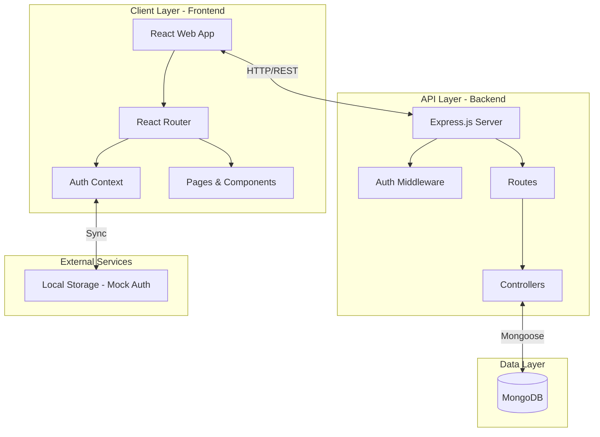

# Vikram University Hostel Management System

This project is a comprehensive management system for the hostels at Vikram University, designed to streamline hostel admissions, room allocations, mess management, and administration.

## 🏛️ System Architecture (HLD)

The system follows a modern monorepo architecture with a clear separation of concerns between the frontend, backend, and database.



## 🛠️ Tech Stack

- **Frontend**: React 19, TypeScript, Tailwind CSS, Framer Motion, Lucide React.
- **Backend**: Node.js, Express.js, Mongoose.
- **Database**: MongoDB.
- **Tools**: Vite, PostCSS, Autoprefixer.

## 📁 Project Structure

- `frontend/`: React-based student and admin interface.
- `backend/`: Node.js/Express API providing RESTful endpoints.
- `docs/`: Project documentation, including exam-related requirements.

## 🚀 Key Features

### For Students
- **Registration & Login**: Secure authentication.
- **Hostel Directory**: View details of available boy's and girl's hostels.
- **Mess Information**: Check mess menus and details.
- **Dashboard**: Personal area for managing hostel-related tasks.

### For Admin/Wardens
- **Admin Dashboard**: Overview of hostel occupancy and student data.
- **User Management**: Manage student registrations and roles.
- **Hostel Management**: Update hostel and room details.

## 🛠️ Getting Started

### Prerequisites
- Node.js (v18 or higher)
- MongoDB (Local or Atlas)

### 1. Frontend Setup
```bash
cd frontend
npm install
npm start
```

### 2. Backend Setup
```bash
cd backend
npm install
# Configure your .env file with MONGODB_URI
npm run dev
```

## 📝 Future Roadmap
- Integration with payment gateways for hostel fees.
- Real-time notification system for announcements.
- Mobile application using React Native.
