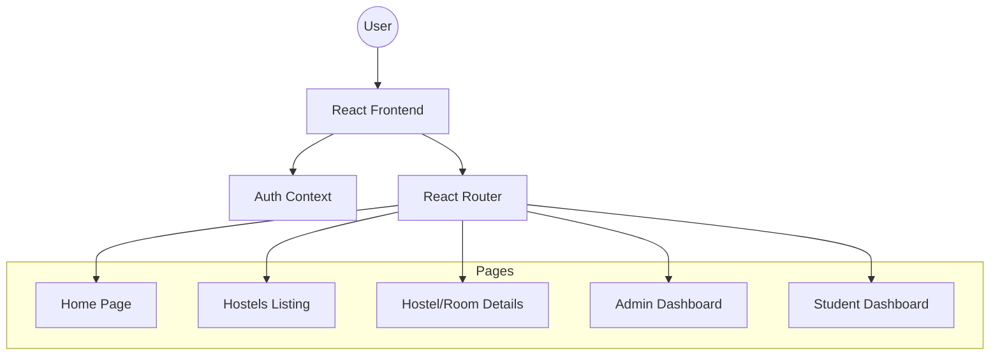
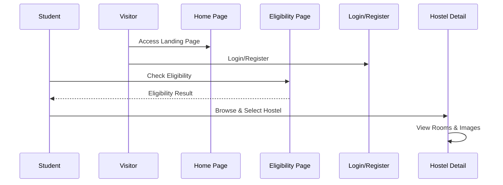
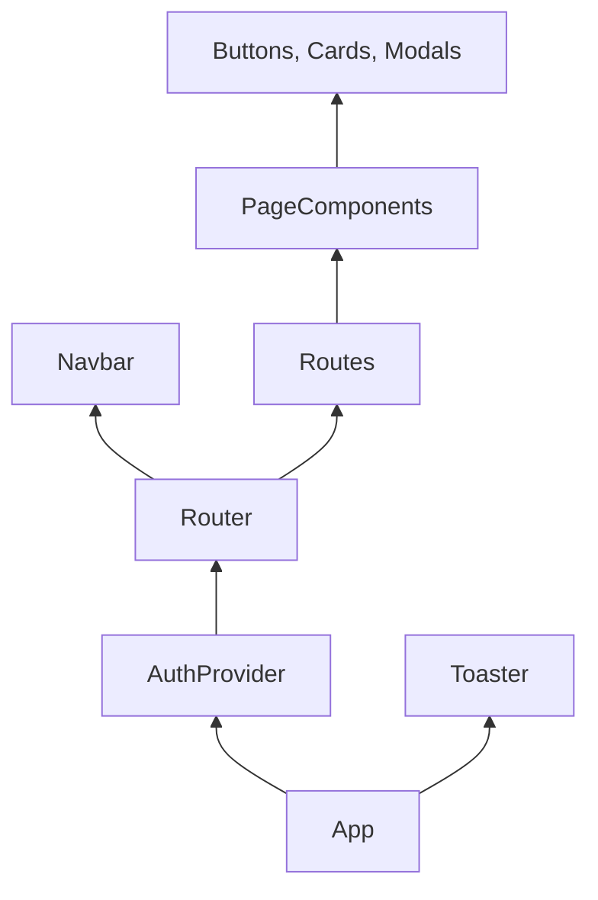

# Vikram University Hostel Management System

A comprehensive digital solution designed to streamline hostel operations, enhance student experiences, and simplify administrative tasks for Vikram University. Built with modern web technologies, this platform provides a seamless interface for hostel discovery, application, and management.

---

## 🚀 Features

### 🏢 For Students
- **Hostel Discovery:** Browse available hostels (Boys & Girls) with detailed information, images, and room views.
- **Eligibility Checker:** Automated tool to check eligibility for different hostel accommodations.
- **Mess Management:** Access information about mess facilities, menus, and updates.
- **News & Updates:** Stay informed with the latest university and hostel-related news.
- **Personal Dashboard:** (In Development) Manage applications, view status, and track notifications.

### 🛡️ For Administrators
- **Comprehensive Admin Panel:** Manage hostel data, student records, and overall system configuration.
- **Dashboard Overview:** Real-time statistics and system health monitoring.
- **User Management:** Control access and roles for different system users.

### 🛠️ Coming Soon
- **Warden Dashboard:** Specialized tools for hostel wardens to manage daily operations and student grievances.
- **Parent Portal:** Dedicated access for parents to track student attendance and fees.
- **Online Fee Payment:** Integrated payment gateway for hostel and mess fees.

---

## 🛠️ Tech Stack

- **Frontend:** [React.js](https://reactjs.org/) (v19)
- **Language:** [TypeScript](https://www.typescriptlang.org/)
- **Styling:** [Tailwind CSS](https://tailwindcss.com/)
- **State Management:** [React Query](https://tanstack.com/query/latest) & Context API
- **Animations:** [Framer Motion](https://www.framer.com/motion/)
- **Icons:** [Lucide React](https://lucide.dev/) & [Heroicons](https://heroicons.com/)
- **Routing:** [React Router](https://reactrouter.com/) (v7)
- **Forms & UI:** [React Hot Toast](https://react-hot-toast.com/), [Slick Carousel](https://kenwheeler.github.io/slick/)

---

## 🏗️ High-Level Design (HLD)

### 1. System Architecture


### 2. User Flow (Hostel Booking)


### 3. Component Hierarchy


---

## 📊 Data Model

The system manages several key entities to provide a complete hostel management experience:

- **Hostel:** Contains metadata (established year, type), facilities, and association with rooms and mess.
- **Room:** Tracks capacity, occupancy, facilities, and rent per room type (Single/Double/Triple).
- **Mess:** Detailed information about meal types, timings, and monthly fees.
- **Officials:** Detailed contact information for Wardens and Assistant Wardens.
- **Students:** (Context-driven) Manages authentication and application state.

---

## 📁 Project Structure

```text
src/
├── components/        # Reusable UI components (Navbar, Loading, etc.)
├── context/           # Global state management (AuthContext)
├── data/              # Static data and mock data (hostelsData)
├── pages/             # Page-level components (Home, Dashboard, Admin)
├── App.tsx            # Main application entry and routing
└── index.tsx          # React DOM entry point
```

---

## ⚙️ Installation & Setup

### Prerequisites
- Node.js (v16 or higher)
- npm or yarn

### Steps
1. **Clone the repository:**
   ```bash
   git clone https://github.com/your-repo/vikram-university-hostel.git
   cd vikram-university-hostel
   ```

2. **Install dependencies:**
   ```bash
   npm install
   ```

3. **Start the development server:**
   ```bash
   npm start
   ```

4. **Build for production:**
   ```bash
   npm run build
   ```

---

## 📝 Project Details

- **Responsive Design:** Fully optimized for Mobile, Tablet, and Desktop views using Tailwind's utility-first approach.
- **Dynamic Routing:** Utilizes React Router 7 for smooth navigation between complex nested routes (e.g., Hostel -> Room).
- **Security:** Implements role-based access control (RBAC) via Context API to protect administrative routes.
- **Visual Appeal:** Enhanced with Framer Motion for smooth transitions and Slick Carousel for high-quality hostel imagery.

---

## 🤝 Contributing

Contributions are welcome! Please feel free to submit a Pull Request.

---

## 📜 License

This project is licensed under the MIT License.
